# resumesupportfe
This repository stores materials to support front-end resume

### 前言

	整个前端部分都是用Vue做的，这个项目的前端不同与普通的前端，这里面的操作逻辑和数据逻辑是十分复杂的，并且还有很多动态可视化交互内容。具体内容见下方描述。

1. 如下图所示，是进入高尔夫模拟器的菜单界面，红色箭头标注的部分是我做的工作内容

   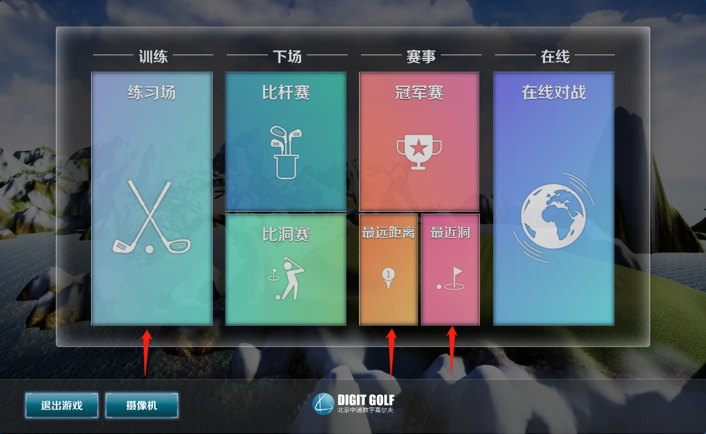

2. 如下图所示，这是进入练习场的场景以及界面，这些界面元素中的数据会随着击球动态刷新。点击右侧上方的头像，可以切换用户，点击杆头图标，可以切换杆型。

   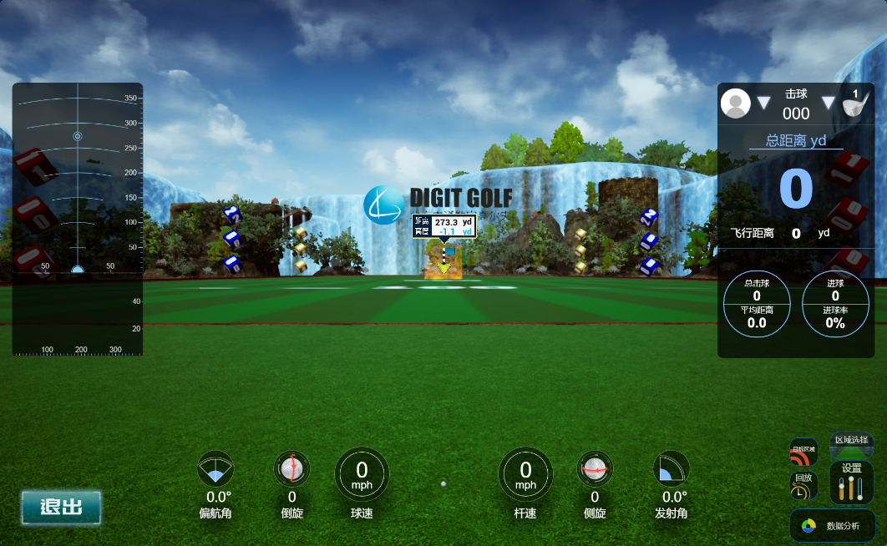

3. 如下图所示，这是击球后视角在移动，同时左侧实时绘制击球轨迹，右侧显示实时飞行数据，下方显示实时击球数据。

   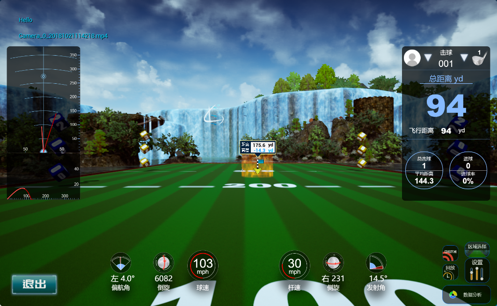

4. 球停之后会自动弹出视频播放窗口，显示刚才用户的挥杆动作，这个视频播放器也是用前端做的。

   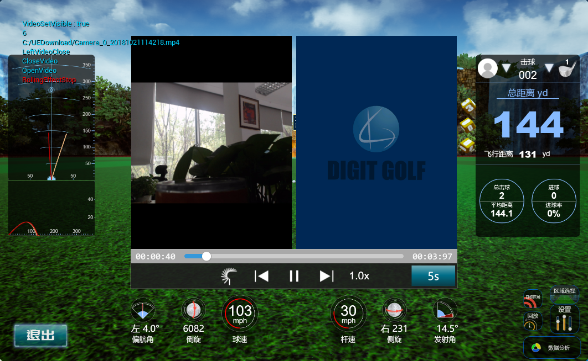

5. 如下图所示，这个是点击练习场右下角数据分析按钮后弹出的数据分析页面，下图为视频分析页面。在这个页面可以在右侧选择挥杆的视频（在线用户有上传功能）。在视频窗口，可以使用绘图板在视频上进行标注，达到挥杆分析的效果。该绘图板是我用D3.js做的一个绘图工具。下方绿色椭圆标注的是各种可用图形。

   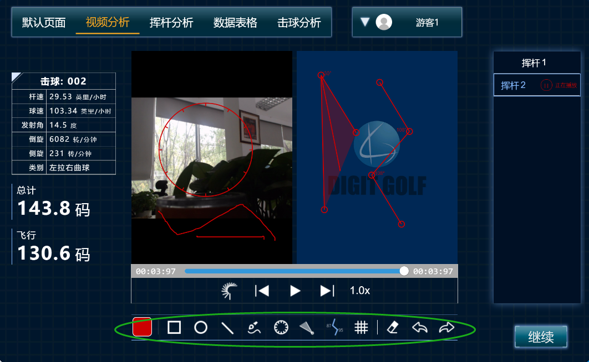

6. 如下图所示，这是数据分析功能中的挥杆分析，右侧的头图是可以动态出现，模拟出挥杆的效果。这个也是用D3.js实现的。

   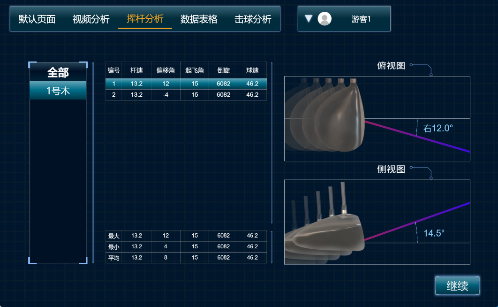

7. 如下图所示，这个实践击球分析页面。

   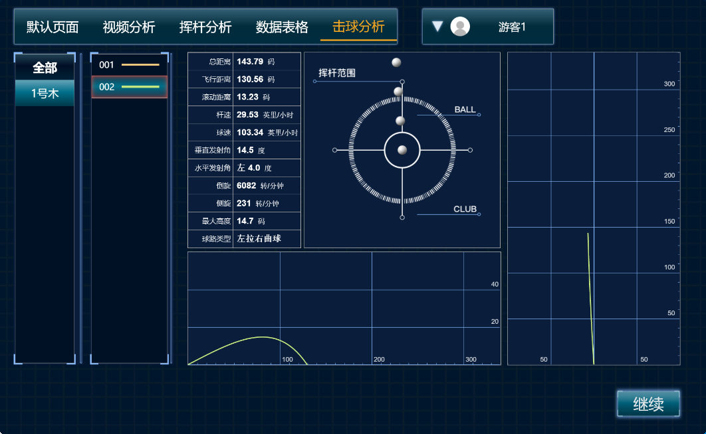

8. 如下图所示，这个是数据表格页面，在这个页面有三种模式：本次数据，历史数据和日历数据。分别可以展示不同数据源不同形式的数据。这个页面的逻辑是十分复杂的。

   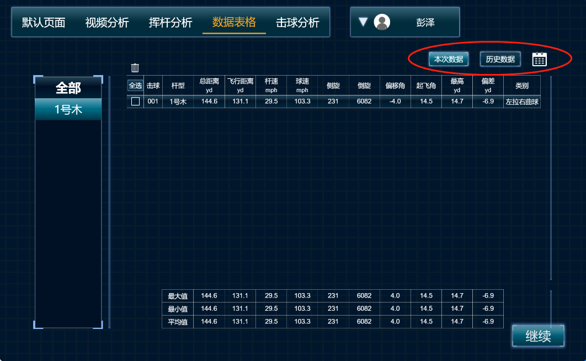

9. 如下图所示，这个是目标区域选择，可以在中间的区域点击，这样就可以选择不同的区域作为目标得分区域。

   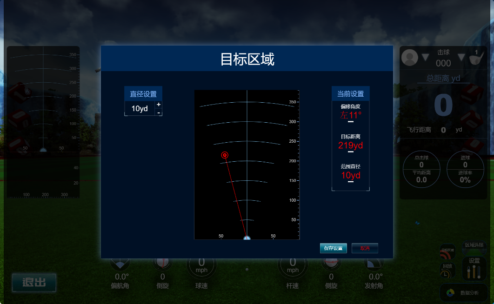

10. 如下图所示，这个是练习场的设置界面。会出现各自的设置树。

    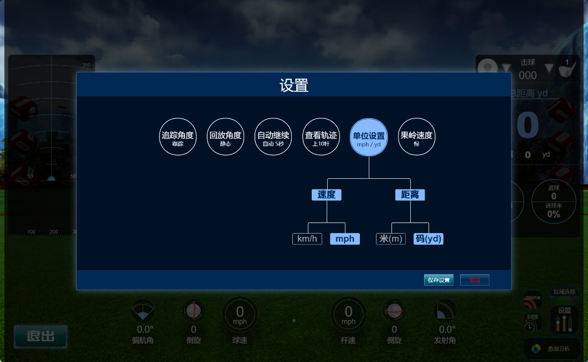

11. 如下图所示，这是区域选择后新的场景和重新调整的界面。

    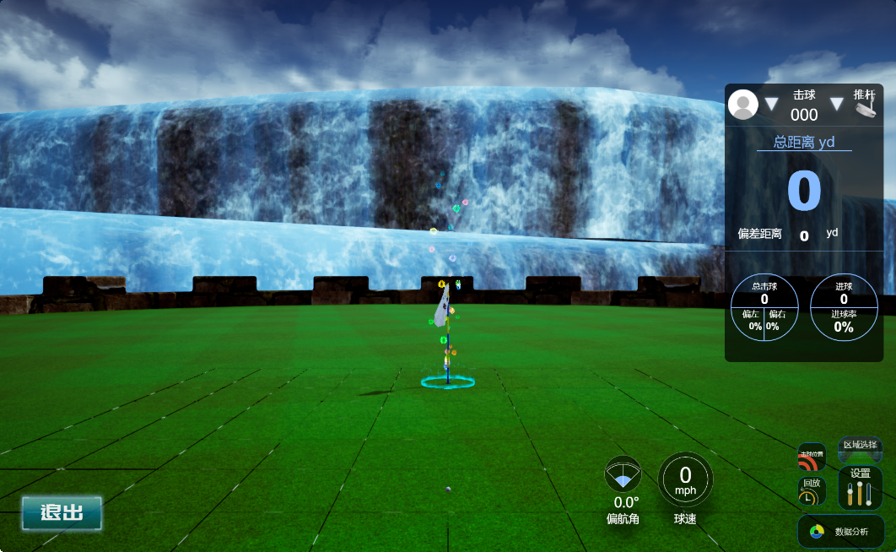